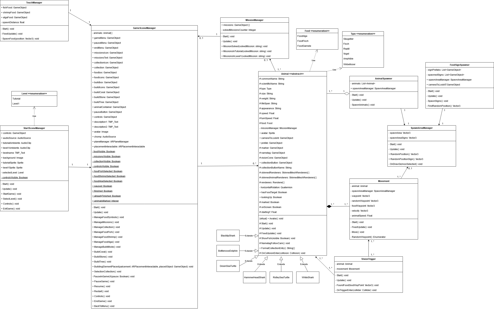
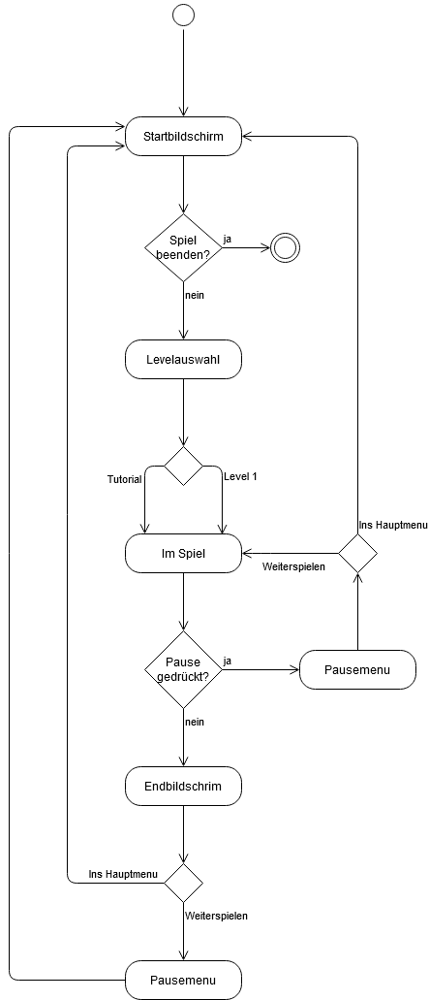
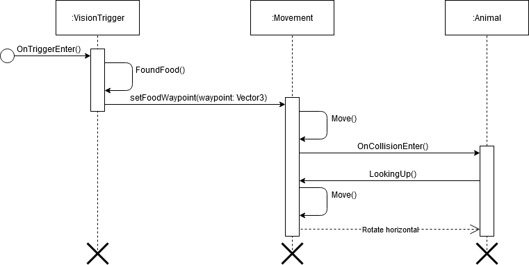

# Technische Dokumentation AVR

## **Eigenleistung**

### **3D Modelle**
Folgende 3D Modelle wurden selber erstellt:
* Marker
* Schilder
* Sichtfeld der Tiere
* Essen:
    * Alge
    * Clownfisch
    * Shrimp
* Bauobjekte:
    * Stein
    * Baumstamm
    * Koralle 

Folgende 3D-Modelle inklusive dazugehörigen Texturen stammen von fremden Quellen:
* Blacktip Shark

    https://sketchfab.com/3d-models/model-9a-blacktip-shark-3bdfcf9c47134d4b9dc9888963622be9
* Bottlenose Dolphin

    https://sketchfab.com/3d-models/model-61a-bottlenose-dolphin-2ec20f15b08c4c2fb16e4df5d837b893
* Green Sea Turtle

    https://sketchfab.com/3d-models/model-72b-juvenile-green-sea-turtle-c90a930f8b2a4cc8bc516742a0df01d9
* Hammerhead Shark

    https://sketchfab.com/3d-models/model-73a-great-hammerhead-shark-77d52f2b0e084fe7bcefbc86b920f080
* Ridley Sea Turtle

    https://sketchfab.com/3d-models/model-52a-kemps-ridley-sea-turtle-no-id-7aba937dfbce480fb3aca47be3a9740b
* White Shark

    https://sketchfab.com/3d-models/great-white-shark-b67415aaa0bd450d865f9604dcdac244

### **Skripte/Skriptausschnitte**
Folgende Skripte stammen von fremden Quellen:
* RendererExtensions.cs

    https://wiki.unity3d.com/index.php?title=IsVisibleFrom

Folgende Skriptausschnitte stammen von fremden Quellen:
* StartSceneManager.cs/ExitGame()

    https://answers.unity.com/questions/1226208/how-to-quit-game-in-unity.html
* Movement.cs/Move(): Mathematische Berechnungen der Fischbewegung (Zeilen 41-43, 53-56)

    https://assetstore.unity.com/packages/3d/characters/animals/nvjob-simple-boids-flocks-of-birds-fish-and-insects-164188
    
    siehe: \\#NVJOB Boids\Example Scenes\Other\Scripts\Shark.cs

Sämtliche andere Skripte des Programms wurden selber erstellt und geschrieben.

### **Sounds**
Abgesehen von dem eingesprochenen Tutorial-Text wurden keine eigenen Sounds im Projekt verwendet.

Folgende Sounds stammen von fremden Quellen:
* Essensgeräusch

    https://freesound.org/people/NillyPlays/sounds/543386/
* Hintergrundgeräusch von "Golf von Mexiko" (Im Projekt: Underwater504641.wav)

    https://freesound.org/people/Fission9/sounds/504641/

* Hintergrundgeräusch von "Pazifischer Ozean" (Im Projekt: Underwater366159.wav)

    https://freesound.org/people/DCSFX/sounds/366159/

### **Texturen**
Folgende Texturen stammen von fremdem Quellen:
* Schilder

    https://www.vecteezy.com/photo/1343842-wood-plank-texture
* Clownfisch

    https://www.pinterest.de/pin/854135885556697534/?d=t&mt=login
* Shrimp

    https://www.feednavigator.com/Article/2014/06/12/CFP-audits-shrimp-feed-chain-as-reports-of-slavery-in-Thai-fish-sector
* Stein

    https://www.stockvault.net/photo/201267/mossy-stone-hdr-texture
* Baumstamm

    * Rinde: https://www.wildtextures.com/wp-content/uploads/wildtextures_old_colorful_oak_bark_texture-1280x1920.jpg

    * Moos: https://previews.123rf.com/images/rangizzz/rangizzz1310/rangizzz131000007/23074664-moss-texture-background-with-copy-space.jpg
* Koralle

    https://upload.wikimedia.org/wikipedia/commons/9/97/Acropora_species5.jpg

### **Bilder/Icons**
Folgende Bilder stammen von fremden Quellen:
* Levelvorschau "Golf von Mexiko"

    https://cdn.hpm.io/wp-content/uploads/2017/08/08160141/Flower-Garden-Banks-NOAA.jpg
* Levelvorschau "Pazifischer Ozean"

    https://s.hdnux.com/photos/75/53/65/16170340/9/1200x0.jpg

Sämtliche andere Bilder wurden von uns selber erstellt.
Die Fischbilder wurden in Verwendung der oben genannten 3D-Modelle vor einem Hintergrund aus

https://assetstore.unity.com/packages/3d/characters/animals/nvjob-simple-boids-flocks-of-birds-fish-and-insects-164188
erstellt.

Sämtliche Icons wurden von uns selber erstellt.

## **Software Dokumentation**
**Klassendiagramm**

**Zustandsdiagramm**

**Aktivitätsdiagramm**

**Sequenzdiagramm**

